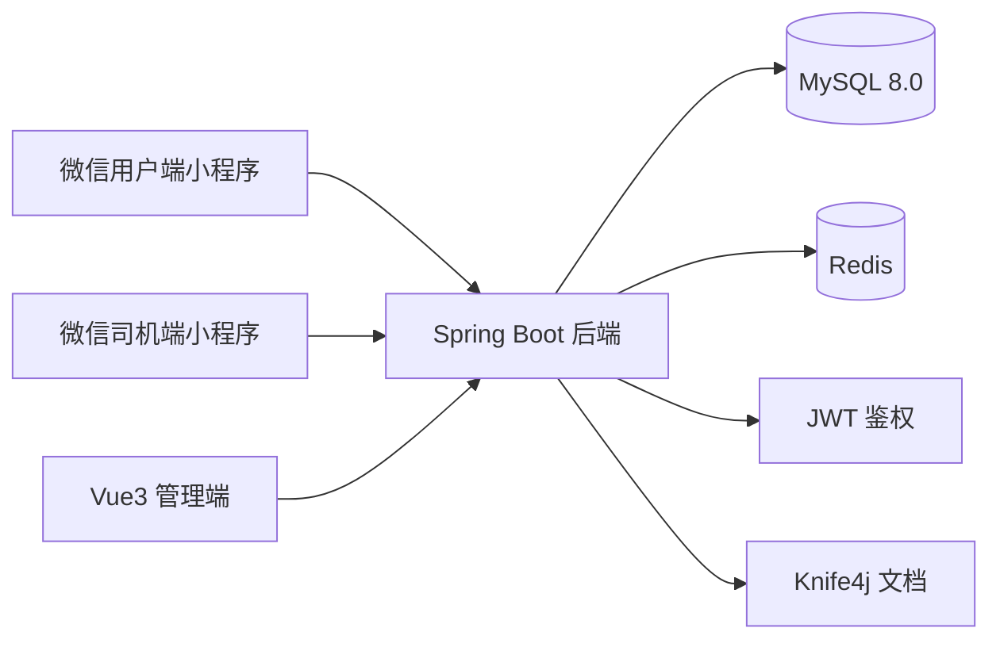
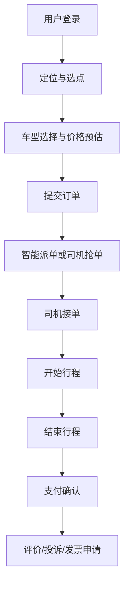
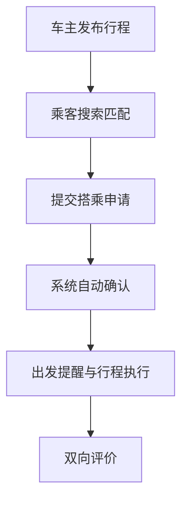
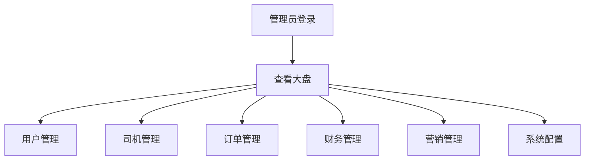
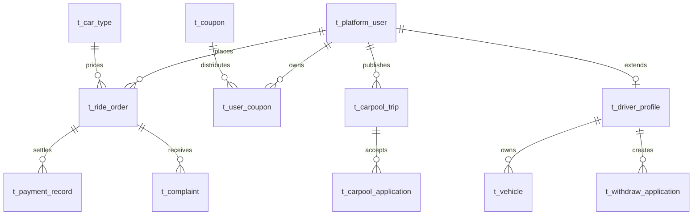

# 阳光出行项目架构设计文档

## 1. 项目概述

阳光出行采用“一个 Java 后端 + 一个 Web 管理端 + 两个微信原生小程序端”的整体架构，覆盖普通用户、司机、平台管理员三类角色，满足即时打车、顺风车、国际出行、营销优惠券、财务结算和后台运营全链路验证需求。

## 2. 系统架构图

## 3. 核心业务流程图

### 3.1 即时打车主流程

### 3.2 顺风车流程

### 3.3 管理端流程

## 4. 数据库 ER 图

## 5. 技术栈选型说明

- 前端用户端与司机端：微信原生小程序，使用 WXML、WXSS、JavaScript，便于项目验收时直接在微信开发者工具打开验证。
- 后端：Spring Boot 3.2.5 + JDK 17，兼顾新版本特性与稳定性。
- ORM：MyBatis-Plus，减少基础 CRUD 开发量，适合项目快速搭建和维护。
- 数据库：MySQL 8.0，结构清晰，便于验收时展示表设计。
- 缓存：Redis，主要用于验证码、消息、会话与后续扩展。
- 鉴权：JWT，适合前后端分离和小程序/管理端多端接入。
- 管理端：Vue3 + Element Plus，学习成本低，展示效果好。

## 6. 验收核心亮点

1. 三端一体化：同一套后端同时服务管理端、用户端、司机端，架构完整。
2. 业务闭环：从注册、下单、接单、支付、投诉、提现到后台审核都能验证。
3. 高可验证性：微信支付、地图高级能力、消息推送全部提供替代方案，不受资质限制。
4. 数据化运营：后台大盘、订单追踪、券管理、财务结算都有落地页面。
5. 验收友好：附 SQL、部署教程、接口文档、测试用例和流程图，适配提交与验收。
